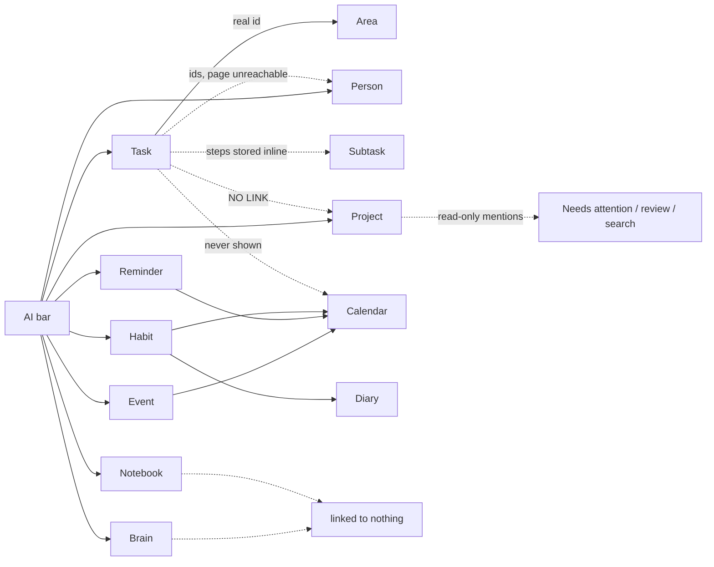

# Life OS — Data Model Map

**Audit date 2026-07-31 · version v239.** Describes the model **as it is today**.

Everything lives in one object `S` in memory, written whole into one Firestore
record per profile: `users/{uid}/data/{profileId}`.

**Legend:** ● required in practice · ○ optional · ✗ does not exist

---

## 1. Task — `S.tasks[]`

The central object. Created in the task modal, by the AI, or by the promise
system.

| Field | Type | Req | Meaning |
|---|---|---|---|
| `id` | string | ● | 7 random chars — **not a UUID**, collisions possible |
| `text` | string | ● | the title |
| `done` | boolean | ● | complete or not |
| `bucket` | `today\|week\|month\|future` | ● | **manual** time bucket |
| `ord` | number | ● | position inside the bucket |
| `area` | `personal\|work` | ○ | legacy two-value split |
| `project` | string | ○ | **an Area id** (`S.workProjects`) or `'gen'` — *not* a project |
| `priority` | `urgent\|hi\|med\|lo\|someday` | ○ | default `med` (manual) / `lo` (AI) |
| `steps` | `[{id,text,done}]` | ○ | subtasks |
| `notes` | string | ○ | free text |
| `scheduledTime` | string | ○ | **free text** ("10am") — never parsed |
| `dueDate` | `YYYY-MM-DD` | ○ | **cannot currently be saved — see limitation 1** |
| `date` | `YYYY-MM-DD` | ○ | creation date, never updated |
| `doneAt` | ms epoch | ○ | completion time |
| `lastCheckedAt` / `prevCheckedAt` | ms | ○ | "I chased this" marker + 1-deep undo |
| `dailyDate`,`dailySince`,`daily` | — | ○ | **dead** legacy Daily/General split |
| `linkedPersonId`,`linkedPromiseId` | string | ○ | back-links into the (unreachable) People system |

**Does NOT have:** duration, files, links, comments, per-task reminders,
recurrence, a project link, an assignee, an energy/effort value.

- **Created:** task modal, AI `addTasks`, promise system.
- **Edited:** task modal (text/time/category/notes on close; priority and steps
  save immediately).
- **Deleted:** `delTask` (confirm) or auto-pruned once completed (keeps 50).
- **Saved:** whole-state write; tick uses an immediate write, everything else a
  300 ms debounce.
- **History/versioning:** ✗ — only a 50-item completed list.
- **Ordering / drag-drop:** ✓ order stored in `ord`; **drag works on mouse only**.
- **AI:** create, complete, delete. Cannot un-complete or edit.

**Limitations**
1. **Due dates cannot be saved.** The date field is rendered in the modal, but
   the only function that reads it (`saveTask`) is never called, and the
   new-task builder does not include `dueDate`. All date→bucket logic is
   therefore inert on new data.
2. Completed tasks vanish after 1.6 s and are hard-deleted past 50.
3. "Stale" nagging uses creation date, so a task deliberately parked in
   *Future* still nags after 14 days.
4. Two different week definitions coexist (bucket logic ends the week Sunday;
   the Today strip starts it Monday).

---

## 2. Subtask ("step") — `task.steps[]`

`{id, text, done}`. Added and deleted only — **cannot be renamed**. Ticking the
last one auto-completes the parent. The parent checkbox is locked while any
step is open. No dates, no ordering field (array order), no notes. Deleting a
step has no confirmation.

---

## 3. Event — Google / Outlook only

Events are **not stored in Life OS**. They are fetched live from Google
Calendar (and Outlook, if configured) on every render and cached in memory.

Normalised shape: `{id, title, description, date, endDate, time, endTime,
allDay, source, colorId, calendarId, calendarColor, recurringEventId}`.

- **Created/edited/deleted:** the event modal → written back to Google.
- **Recurrence:** read is fully expanded by the provider. Writing supports only
  daily / weekly / monthly / monthly-by-weekday / yearly — **no interval, no
  count, no end date**.
- **All-day:** supported.
- **Timezone:** times are shown as the **event's own** wall clock, not
  converted to the viewer's. Outlook events are requested in UTC and displayed
  unconverted, so they appear shifted.
- **Writing hard-codes `Africa/Johannesburg`** as the default zone, and always
  creates on the *primary* calendar regardless of the picker.

`S.customEvents` still exists but is **force-emptied on every load and written
back empty** — a deliberate one-way cleanup of old "ghost" events.

---

## 4. Reminder — `S.reminders[]` (three different things share this word)

**(a) Life OS reminder** — `{id, text, recurrence:{type,weekdays,dayOfMonth,
month,day}, nextDue, lastCompleted, createdAt}`. Recurs daily/weekly/monthly/
yearly. Local only — never sent to Google. Shown on Today when due and in the
calendar's Reminders mode. AI can create and complete them.

**(b) Google Tasks** — imported read-mostly; shown as 🔔 chips. The event
modal's "Reminder" type creates one of these. Always all-day.

**(c) Per-event notification offsets** — minutes-before values written onto a
Google event.

---

## 5. Project — `S.builds[]` (user-facing "Projects")

| Field | Type | Req | Meaning |
|---|---|---|---|
| `id`, `title` | string | ● | |
| `desc` | string | ○ | "what this is" — **AI overwrites it** on log |
| `status` | `active\|future\|background` | ● | phase |
| `auto` | boolean | ○ | if true, phase is derived from recency (7d/30d) |
| `stage` | 0–6 | ○ | index into a fixed 7-stage list |
| `date` | `YYYY-MM-DD` | ● | creation only, never edited |
| `lastTouched`,`prevTouched` | ms | ○ | recency |
| `notes` | string | ○ | scratch text |
| `log` | `[{id,at,date,stage,text}]` | ○ | dated entries, **AI-only** |
| `whatsNext` | string | ○ | AI-written, no manual editor |
| `entries` | legacy | — | read-only remnant |

**Does NOT have:** start date, due date, milestones, subtasks, dependencies,
progress %, priority, files, images, links, comments, assignees, calendar
presence, or **any link to tasks**.

- Progress is derived two ways: stage index → % bar, and recency → phase badge.
- Manual log entries are impossible without an API key (the log flow is AI-only).
- **AI:** create, add a note. Cannot delete or restructure.

---

## 6. Area — `S.workProjects[]` (called "Areas" in Settings)

`{id, name, color, order}` plus two implicit built-ins (Personal, Work) whose
only stored state is their sort order. **This is what `task.project` points
at.** Deleting an area reassigns its tasks to `gen`. Reorder by drag (mouse
only). No dates. Unrelated to Projects.

---

## 7. Habit — `S.habits[]`

`{id, name, description, checkedDates[], createdAt, excludedDays[], notes[]}`.

- `checkedDates` is the single source of truth; streak/total are always
  recomputed (persisting them once caused habits to auto-tick).
- `excludedDays` = rest weekdays (0–6). Missing a rest day does not break a
  streak.
- Streak has a one-day grace; tiers at 10/24/50/100/200/300/400/1000 days.
  (The progress-ring milestones use a *different* scale — 3/7/14/21/30/60/100/
  200/365.)
- Shown in the right rail and in the calendar's habit mode (tickable per day).
  The full Habits page still exists in the file but is **unreachable**.
- **AI:** create, tick (including bulk back-dating). Cannot delete.

---

## 8. Diary entry — `S.routineLog[YYYY-MM-DD]`

**Not** `S.dayNotes`. Shape: `{checks:{itemId:bool}, journal:{j1..j5}}`.

- **Exactly one entry per day**, five fixed questions defined in code and not
  user-editable.
- **No id, no timestamp, no title, no tags, no mood.**
- Journal text and the routine checklist live in the **same object**.
- **Saves only on blur** — text typed and never blurred is lost.
- **Cannot be deleted** (clearing writes an empty string; the day key is
  permanent) and **cannot be searched** anywhere.
- AI reads it only for the weekly review; there is no AI operation that writes
  diary text — yet on the Diary page the AI bar silently gets **full
  app-wide write power**, because "diary" is missing from the scope table.

---

## 9. Notebook — `S.notebook`

`{sections:[{id, title, color, pages:[{id, layout, cells:[HTML], updatedAt}]}]}`
Layout is `single|half|quad` → 1/2/4 cells.

- Content is **raw HTML strings** produced by `contenteditable` +
  `document.execCommand` (deprecated). Legacy plain-text cells are converted at
  render time only, so storage stays mixed.
- Formatting: bold, italic, underline, strikethrough, heading, bullet list,
  numbered list, highlight, clear. **No tables, images, links, checklists, or
  code blocks.**
- Pages have no title; nothing except `page.updatedAt` is dated.
- Undo: 40 steps, **memory only** — lost on reload. No redo. No versioning.
- Deleting the last page deletes the whole section.
- Changing layout **merges cells destructively**.
- Autosave: 1.2 s debounce while typing; structural changes save immediately.
  Redraw is suppressed while a cell is focused (a real data-loss guard).
- AI: `addNotebookEntry` appends a page (creating the section if needed). The
  per-page "Refine" is the only feature that sends notebook content to the model.

---

## 10. Brain items — `S.ideas[]`, `S.resources[]`, `S.notes[]`

| Collection | Tab | Fields |
|---|---|---|
| `ideas` | Ideas | `{id, title, desc, date}` |
| `resources` | Resources | `{id, title, url, desc, tag, date}` — tag ∈ article/tool/video/book/person/other |
| `notes` | **Knowledge** | `{id, title, body, date}` — note `body`, not `desc` |

One shared modal edits all three. Search is a plain substring match **within
Brain only**. **No tags beyond the resource tag, no links between items, no
embeddings, no semantic search, no graph.** The AI can create all three but
receives only their **titles** and cannot read, edit or delete them.
`S.learning` is a dead fourth collection still written on every save.

---

## 11. Person / Promise — `S.people[]` (unreachable)

`{id, name, metAt, phone, email, notes, tags[], level:{major,minor},
promises:[{id,text,date,addedAt}], lastTogether}`. The page is unreachable, but
**the data is still saved on every write**, the AI can still create people and
promises, and completing a linked task can delete the task and update the
person. `lastTogether` is written as an object but read as a date string, so
the "haven't seen X" nudge silently never fires again once used.

---

## 12. AI instruction / preview

There is **no stored AI-instruction object**. A user sentence produces one JSON
object whose keys are operation names (`addTasks`, `addEvent`, …) and whose
values are arrays. That object is the "preview". It exists only in memory until
applied or discarded. `S.aiHistory[]` (capped 200) stores an after-the-fact
record: `{at, prompt, summary, detail, message}`.

---

## 13. User profile / settings

Profile catalogue: `users/{uid}/data/_index` → `{profiles:[{id,name,mode,
createdAt}], activeProfileId}`. **Maximum two profiles.** Each profile is a
separate record with its own Google/Outlook token.

Settings split across three homes:
- **Synced** (in the record): AI confirm mode, API key (**plaintext**), life
  rhythm, AI memory, calendar defaults, default write calendar, disabled
  calendars, areas, routine, faith focus, habit catch-up, check-in level,
  people settings, sounds.
- **Device-only** (localStorage, never synced): **theme**, AI Do/Ask mode, all
  three notification systems, notebook spread + font, settings tab, month
  detail.
- **Never stored:** `S.mode` is derived; `soundsEnabled` is dual-written.

---

## 14. Relationships — plain English

```
Task
 → belongs to an AREA (real id reference; falls back to `area` if missing)
 → does NOT belong to a Project            ← the biggest structural gap
 → may have subtasks (steps), stored inside the task itself
 → has a manual bucket (Today/Week/Month/Future) — not a date range
 → may have a dueDate … which currently cannot be saved
 → never appears on the Calendar
 → may be created/completed/deleted by the AI
 → may be linked to a Person + Promise (one-way ids, page unreachable)

Event  (lives in Google/Outlook, not in Life OS)
 → belongs to a calendar
 → may recur (read fully; write supports 5 simple rules)
 → has no link to tasks, projects, or habits

Reminder (Life OS)  → recurs on its own schedule → shown on Today + Calendar
                    → never syncs to Google

Project
 → has NO tasks, NO dates, NO milestones, NO dependencies
 → contains its own notes + AI-written log entries
 → surfaces read-only in: Needs-attention, weekly review, search, AI context
 → never appears on the Calendar

Habit
 → owns a list of ticked dates
 → appears in the right rail AND on the Calendar (tickable per day)
 → influences Today only through the rail + catch-up prompt

Diary (routineLog[date])
 → holds the journal AND the routine tick-boxes in one object
 → links to Habits via the habit stamps on the page
 → not searchable, not deletable, referenced by nothing else

Notebook
 → sections → pages → cells; linked to nothing else in the app

Brain (ideas / resources / notes)
 → three flat lists; no links between them or to anything else

AI Command Bar
 → reads a scope-limited snapshot of most collections
 → writes DIRECTLY into memory, then one save
 → previews only when confirm-mode is "all", or when people are involved
```

**How links are stored:** the only real id references are
`task.project → area.id`, `task.linkedPersonId/linkedPromiseId → person`, and
`event.calendarId`. Everything else the AI "links" is resolved by **matching
text at the moment of application** (project by fuzzy title, person by strict
name, habit/task by partial text). Nothing is re-validated afterwards, and
**nothing is two-way**.

**If a linked object is deleted:** deleting an Area reassigns its tasks to
`gen` (the only referential clean-up in the app). Everything else leaves
dangling values that are silently ignored at render time.


