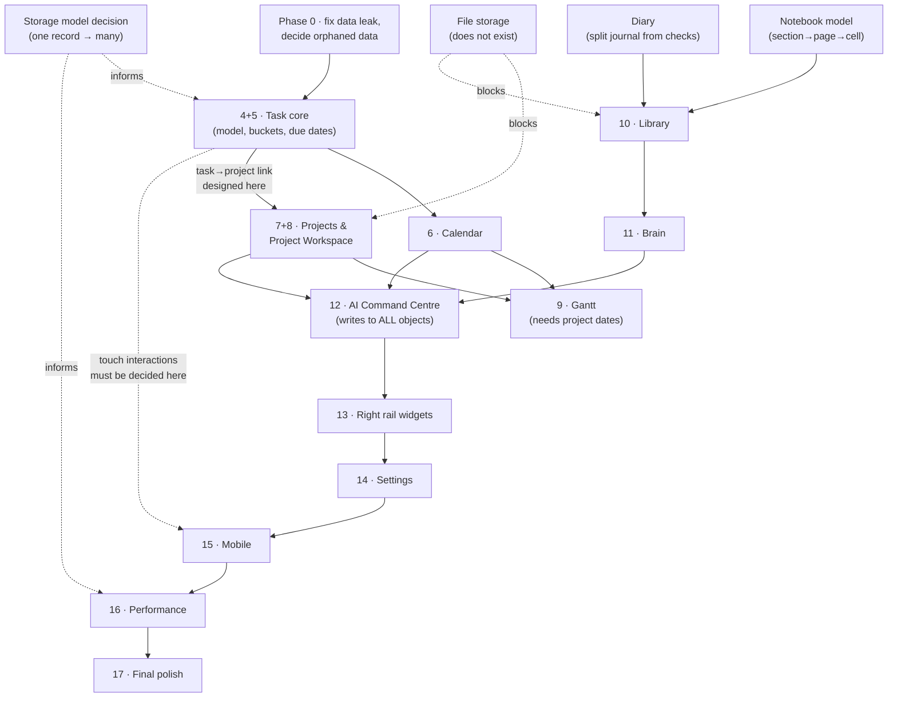

# Life OS — Redesign Dependency Map

**Created 2026-07-31 (audit step). Version at audit: v239.**

This document answers one question: **in what order should the systems be
rebuilt, based on what actually depends on what in the code today?**

It is derived from the audit, not from preference.

---

## 1. The dependency facts that drive the order

These are the real couplings found in the code. Everything below follows from
them.

| # | Fact | Consequence for ordering |
|---|---|---|
| D1 | **Tasks are not linked to Projects at all.** `task.project` points at an *Area* (`S.workProjects`), never at a project (`S.builds`). | Any Project Workspace with a task list needs a **new** link field. Task model must be settled first. |
| D2 | **The whole app is one database record**, saved whole on every change. | Splitting storage affects every system. Do it once, deliberately — not per screen. |
| D3 | **There is no file/image/attachment capability anywhere.** | Project documents and Library media are blocked until this is built. It is infrastructure, not a screen. |
| D4 | **The AI writes directly into every collection** (20 operations). Its schema hard-codes today's field names, including the dead Daily/General model. | Every object reshape breaks the AI. The AI must be re-pointed **after** the objects settle, not before. |
| D5 | **The Diary is entangled with the routine checklist** — `routineLog[date]` holds `journal` *and* `checks` in one object. | Diary cannot move into a Library until journal and checks are separated. |
| D6 | **The Notebook is already a 3-level tree** (section → page → cell) with ids, and all access goes through a handful of helpers. | A Library ("books") is a 4th level. Notebook is the natural foundation; Diary is not. |
| D7 | **Projects have no dates** — no start, no due, no milestone, no dependency, no per-stage timestamps. | A Gantt view is **impossible** on today's data. Project model must gain dates first. |
| D8 | **Buckets (Today/Week/Month/Future) are stored manual statuses**, not date ranges. Due dates only cap how late a task may sit. | Any calendar/timeline integration for tasks depends on the task date model being fixed. |
| D9 | **Drag-and-drop is HTML5-only and does not work on touch**, with no alternative control. | Mobile task management is currently impossible. Affects the mobile step and the task step. |
| D10 | **Rendering is global** — one `render()` redraws every list on every page. | Performance work is cross-cutting; per-screen optimisation will not fix it. |

---

## 2. The recommended order

The user's stated order is sound. The audit changes **three** things, all
argued below.

### Phase 0 — Fix-before-you-build (blocking correctness)
These are small, contained, and will silently corrupt or waste redesign work
if left. **Recommend doing these first, before Step 4.**

1. **Cross-profile data leak** (`technical-debt.md` D1) — switching profiles
   can copy one profile's reminders/people into another. Data-integrity bug.
2. **Due dates cannot be saved** (D2) — the date picker in the task modal is
   never read; the only code that reads it is never called. The whole
   date→bucket feature is inert. **This must be fixed as part of the Task
   redesign, not before it** — but it must not be forgotten.
3. **Decide the fate of orphaned data** — `S.dayNotes` (invisible, still
   saved), `S.people`/`peopleTags` (unreachable page, still saved),
   `S.learning` (dead, still saved). Decide *keep / migrate / delete* before
   any storage change, or the decision gets made accidentally.

### Phase 1 — Foundations (already done)
1. ✅ Global Design System
2. ✅ Navigation & Sidebar
3. ✅ Design Tokens & Motion + Autosave

### Phase 2 — The task core
4. **Today Dashboard**
5. **Task Detail View**

> **Recommendation: treat 4 and 5 as one unit.** They edit the same object and
> the same save path. The task detail modal is where the broken due-date save
> lives; the dashboard is where buckets and drag-and-drop live. Splitting them
> means touching the task model twice.

### Phase 3 — Time
6. **Calendar**

> Depends on the task date model from Phase 2 (D8). Do not attempt the Gantt
> here — projects have no dates yet (D7).

### Phase 4 — Projects
7. **Projects (full redesign)**
8. **Project Detail Workspace**
9. **Gantt View**

> **Order dependency:** 7 → 8 → 9 is correct and strict. The Gantt (9) is
> impossible until the project model gains start/end dates, milestones and
> dependencies (D7), which happens in 7–8.
>
> **New dependency the plan does not mention:** a Project Workspace that
> contains tasks requires a **task→project link that does not exist today**
> (D1). That link should be designed in Phase 2 (as a field on the task) even
> though it is not *used* until Phase 4. Otherwise the task model is reopened.
>
> **Blocked sub-feature:** documents / images / videos on projects require
> file storage (D3), which does not exist. Either build file storage as its
> own step inside Phase 4, or explicitly defer those fields.

### Phase 5 — Writing
10. **Library (Diary + Notebook merge)**

> Build the Library **on the Notebook's model** (D6) and migrate the Diary
> into it, not the reverse. Requires first separating `journal` from `checks`
> in `routineLog` (D5). Requires deciding what happens to `S.dayNotes` (D3 in
> Phase 0).

### Phase 6 — Knowledge and intelligence
11. **Brain**
12. **AI Command Centre**

> **This ordering is important and matches the user's plan.** The AI writes
> into every collection (D4); rebuilding it before the objects settle
> guarantees rework. Brain before AI is right, because Brain is one of the
> collections the AI writes into.

### Phase 7 — Surfaces and platform
13. **Right Sidebar Widgets**
14. **Settings**
15. **Mobile Experience**

> **Recommendation: move mobile earlier, or at least start it earlier.**
> Touch drag-and-drop does not work (D9), so *task management is impossible on
> a phone today*. If Life OS is meant to be used on a phone, the Phase 2 task
> redesign should choose interactions that work on touch from the start,
> rather than designing desktop-only drag and retrofitting later. Full mobile
> polish can still live at 15; the *interaction choice* cannot wait.

### Phase 8 — Finishing
16. **Performance Optimisation**
17. **Final Polish**

> **Caveat:** global rendering (D10) and the single-record storage model (D2)
> are architectural. If either is going to change, changing it at step 16 means
> re-touching every screen built in steps 4–15. Consider pulling the
> **storage-splitting decision** forward to Phase 0/2 as a *decision* (even if
> the implementation waits), so screens are built against the intended shape.

---

## 3. Summary of proposed changes to the plan

| Change | Why |
|---|---|
| Add a **Phase 0** for the profile data leak and the orphaned-data decision | Both silently corrupt/lose data; both are cheap now, expensive later |
| Treat **Today + Task Detail as one unit** | Same object, same save path, and the broken due-date save sits between them |
| Design the **task→project link** during Phase 2, use it in Phase 4 | Otherwise the task model is reopened mid-Project work |
| Decide **touch interactions during Phase 2**, not at step 15 | Drag-and-drop is desktop-only today; tasks are unusable on mobile |
| Treat **file storage** as an explicit step inside Phase 4 | Project docs/media and Library files are blocked without it; it does not exist at all |
| Make the **storage-model decision** early even if implemented late | It is the one change that would otherwise invalidate every screen |

---

## 4. Dependency diagram

